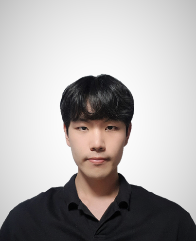

#### 2021 Practical Coding - 2021-하계방학 실전 코딩 1

## 소개

<table>
    <tr>
        <td>
           
        </td>
        <td style="text-align:center;"> 
            

                은승균
                 
                소프트웨어학과
                 
                24살/남
            

             
            

                안녕하세요. 아주대 소프트웨어학과 재학중인 은승균입니다!
            

        </td>
    </tr>
</table>

 

### 👍좋아하는 것

---

#### 💪헬스

- 성장중인 헬린이🏋️‍♀️
- **S**:135kg / **B**:100kg / **D**:145kg

#### 🚴‍♀️자전거

- 아주대학교 중앙동아리 ROA로 오세요~

#### 🍕먹는 것

- 고기가 좋아요🥩

#### 💰월급

- 돈은 필수라고 생각해요

#### 🎧좋아하는 가수

- 아이유

#### 🎬좋아하는 영화

- 마블 시리즈

 

### 😨싫어하는 것

---

1. 오이
2. 여름
3. 개강

 

### 🎥재미있게 본 영화

---

1. 마블 시네마틱 시리즈
2. 인터스텔라
3. 인셉션
4. 헝거게임 시리즈

 

### 💻관심 기술 스택

---

- WEB 프론트엔드 - JavaScript, React.js, Vue.js
- Python
- Java, Kotlin
- Flutter

 

### 📖공부 중...

---

- React.js
- React Native
- Node.js
